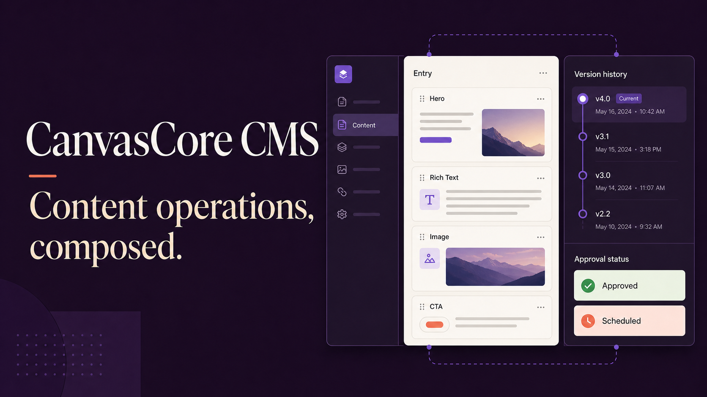
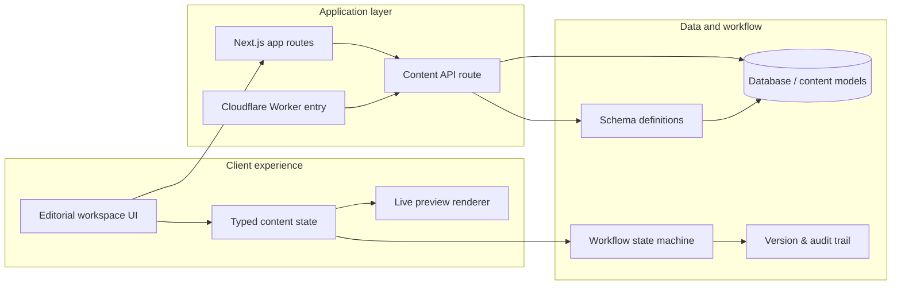

# CanvasCore CMS

> Content operations, composed.

CanvasCore is a production-minded enterprise content management showcase inspired by the workflows behind Contentful, Sanity, and modern headless platforms. It demonstrates schema-driven content, complex local state, granular permissions, editorial workflow, live preview, and scalable UI composition in a polished single workspace.



## Product highlights

- Three-pane visual editor with reorderable-style content blocks, typed properties, and instant site preview
- Draft → review → approval → publish workflow with role-aware actions
- Editor, Reviewer, and Admin permission simulation
- Version history, audit metadata, restore actions, and save feedback
- Content library with search/filter UI, editorial metrics, locales, and statuses
- Schema studio showing reusable content models and validation contracts
- Team permission matrix designed around least-privilege access
- Responsive enterprise interface with semantic regions, keyboard focus, and reduced-motion support
- Mock content API, unit checks, Playwright smoke test, CI, and Docker

## Architecture

The application is organized as a layered content platform prototype: a rich editorial experience in the browser, a mock content API boundary, and a lightweight data/workflow layer that can be expanded into production services.



### How the pieces fit together

- The editorial UI runs in the browser and manages content state, block composition, and workflow actions locally for a fast demo experience.
- The app routes and API route provide a clean boundary for content reads and writes, mirroring how a headless CMS would expose data to clients.
- The schema layer defines the shape of content models, while the database layer stores the structured records and relationships needed for a real content platform.
- Workflow and audit state are separated so draft, review, approval, and publish transitions can be modeled explicitly and extended with permissions or automation.
- The preview renderer is fed from the same content state so authors can see changes immediately without needing a separate publishing pipeline.

The prototype keeps state local so the showcase runs without credentials, but the boundaries map directly to production services such as content APIs, schema registries, workflow engines, policy services, preview delivery, and audit event stores.

## Stack

React 19 · TypeScript · Next-compatible App Router · Tailwind CSS · Vinext/Vite · Cloudflare Workers · Node Test Runner · Playwright · ESLint · Prettier · GitHub Actions · Docker

## Quick start

```bash
cp .env.example .env.local
npm install
npm run dev
```

Open `http://localhost:3000`.

## Quality commands

```bash
npm run lint
npm run typecheck
npm test
npm run test:e2e
npm run format:check
npm run build
```

## Project structure

```text
app/
  api/content/route.ts   Mock headless content API
  page.tsx               Editorial workspace and feature views
  globals.css            Responsive enterprise design system
e2e/                     Browser smoke journey
tests/                   Repository-level unit checks
.github/workflows/       CI quality gates
worker/                  Cloudflare-compatible application entry
```

## State and permission design

Permissions are derived capabilities rather than scattered role checks:

```ts
const permissions = {
  canEdit: role !== "Reviewer",
  canApprove: role !== "Editor",
  canPublish: role === "Admin",
};
```

This keeps interface behavior, disabled states, and workflow transitions consistent. A production implementation would resolve capabilities server-side and treat client checks as presentation only.

## Tradeoffs

- **Local state over persistence:** makes the portfolio demo instant and deterministic. The API boundary shows where durable storage belongs.
- **Button-based composition over full drag-and-drop:** preserves accessible keyboard behavior and focuses the showcase on content architecture. A production implementation would use a keyboard-capable DnD library.
- **Role simulation over authentication:** makes permission behavior interviewable without test accounts. Production enforcement must happen on every server mutation.
- **Immediate preview over iframe isolation:** keeps the demo lightweight. Production preview would render a signed draft URL in a sandboxed iframe.

## Interview talking points

1. Model workflow transitions as a state machine and reject invalid server-side transitions.
2. Separate roles from capabilities to support custom enterprise policies.
3. Use optimistic updates with mutation IDs and rollback for collaborative editing.
4. Store immutable content versions and append-only audit events.
5. Resolve references in a content delivery layer while keeping authoring normalized.
6. Add presence, conflict detection, and field-level locking for real-time collaboration.

## Roadmap

- [ ] Durable content and version storage
- [ ] Auth.js with workspace membership
- [ ] Collaborative presence and comments
- [ ] Scheduled publishing and webhooks
- [ ] Media library backed by object storage
- [ ] Locale fallback and translation workflow
- [ ] JSON Schema model builder
- [ ] Signed preview environments

## License

MIT — created as a senior frontend/full-stack engineering portfolio project.
